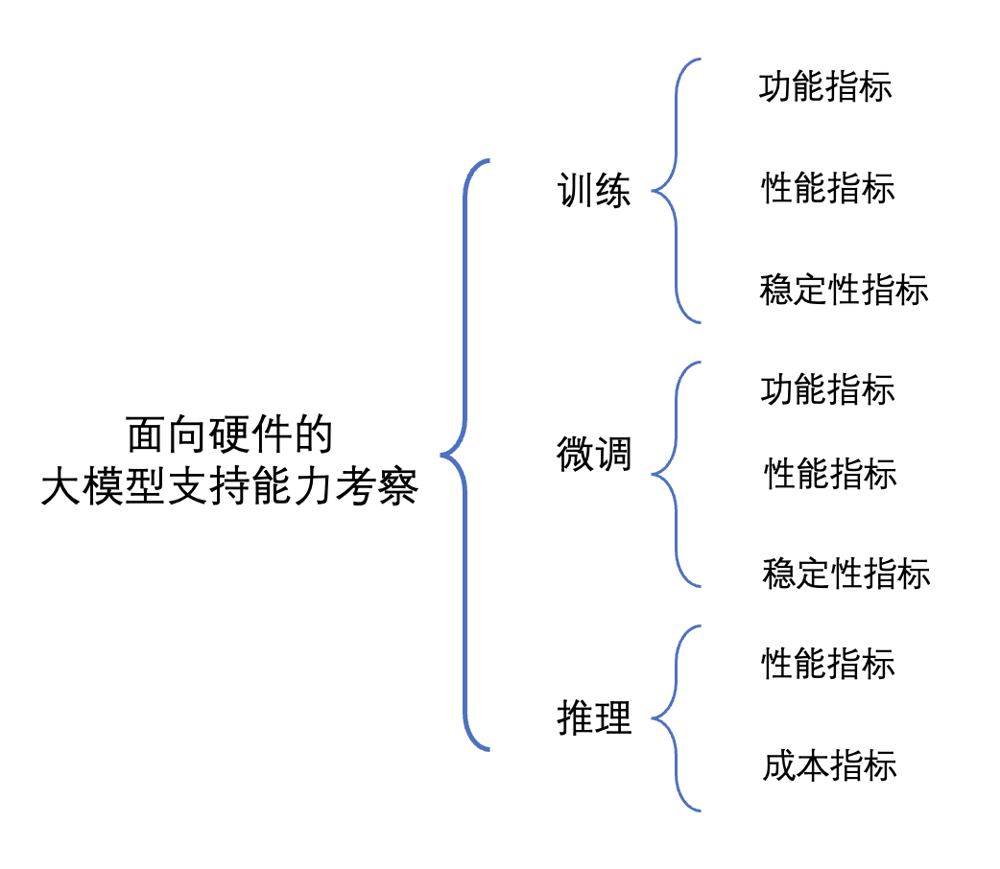

# AIChipBenchmark

## 硬件测评

硬件测评是面向国产深度学习加速卡进行的多维度评测工作。硬件测评提供一套标准的行业测试方法，提供技术规格、软件生态、功能测试、性能测试等多视角，并周期性产出标准测评结果。硬件测评结果可用作各类国产加速卡在不同维度表现的参考。

硬件测评适用于芯片生产厂商、应用厂商、前场销售及第三方机构对计算机视觉领域面向云侧的深度学习训练芯片（包含AI芯片模组和AI加速卡等形态）进行设计、采购、评测。

### 面向硬件的传统模型评测实施方案

上海人工智能实验室每季度开展针对国产AI训练芯片的评测工作，多家国产芯片厂商积极参与。实验室对送测芯片进行技术规格、软件生态、功能、性能等多维度测试，并按季度产出硬件评测报告。评测结论可以为算力市场产品选型提供参考依据，同时芯片厂商也可更加客观的发现自身软硬件产品的不足，促进产品迭代。通过组织AI芯片厂商开展评测工作，可以根本上推进软硬件之间的解耦适配，极大降低算力使用门槛，实现算力要素多样化，为国产芯片高效服务国产大模型保驾护航。 

面向硬件的传统模型评测实施方案的主要评测指标如下：
<table>
    <tr>
        <th>测试大项</th>
        <th>测试小项</th>
        <th>小项说明</th>
    </tr>
    <tr>
        <td rowspan="4">基本技术规格 </td>
        <td>算力</td>
        <td>考察计算芯片的计算能力，关键指标之一</td>
    </tr>
    <tr>
        <td>内存规格</td>
        <!--  -->
        <td>考察芯片的显存容量和显存带宽</td>
    </tr>
    <tr>
        <td>通信带宽</td>
        <td>考察芯片的跨卡跨机数据传输能力</td>
    </tr>
    <tr>
        <td>能耗比</td>
        <td>芯片算力与芯片标称功耗的比值</td>
    </tr> 
 	<tr>
        <td rowspan="2">软件生态</td>
        <td>软件栈</td>
        <td>考察芯片对于常用库的支持程度 </td>
    </tr>
    <tr>
        <td>开放性</td>
        <td>考察芯片与业界主流异构计算的模型、接口兼容程度</td>
    </tr>
    <tr>
        <td rowspan="2">功能测试</td>
        <td><a href=="https://github.com/DeepLink-org/AIChipBenchmark/tree/main/operators/accuracy_test">算子功能 </a></td>
        <td>考察芯片对算子的支持程度</td>
    </tr>
    <tr>
        <td><a href="https://github.com/DeepLink-org/AIChipBenchmark/blob/main/models/readme.md">模型功能 </a></td>
        <td>考察芯片对基础模型的支持程度</td>
    </tr>
    <tr>
        <td rowspan="3">性能测试</td>
        <td><a href ="https://github.com/DeepLink-org/AIChipBenchmark/blob/main/operators/speed_test/readme.md">算子性能 </a></td>
        <td>考察算子在芯片上的运算时间</td>
    </tr>
    <tr>
        <td>模型性能</td>
        <td>考察模型在芯片上的训练性能</td>
    </tr>
    <tr>
        <td><a href="https://github.com/DeepLink-org/AIChipBenchmark/blob/main/operators/speed_test/communication_bench/readme.md">通信性能</a></td>
        <td>考察算⼦在单节点多芯⽚、多节点多芯⽚条件下的性能表现</td>
    </tr>
</table>

### 面向硬件的大模型评测实施方案

国产AI芯片的大模型支持也是重点考察的能力，增加大模型训练功能、性能及稳定性指标、大模型微调功能、性能以及稳定性指标以及大模型推理性能及成本指标，全面覆盖模型训练、微调和推理三大关键环节： 

评测的结果将为硬件厂商提供宝贵的参考信息，帮助他们了解自身在大模型领域的发展方向和优化需求。同时，评测结果也将为用户和开发者提供有价值的参考，帮助他们选择适合自己需求的硬件设备，并优化和改进应用程序的性能和效果。 
我们期待通过这一评测方案的实施，能够为国产硬件的发展注入新的动力，推动大模型技术的普及和应用，促进语言处理领域的创新和进步。 

  

## 测评流程

（1）于上一期厂商反馈意见，更新评测实施方案并发放； 

（2）厂商基于实施方案对自家芯片进行测试； 

（3）厂商提交数据和验证材料，实验室进行结果核验； 

（4）实验室完成单芯片评测报告整理，点对点发放。 

## 联系方式
如果您所代表的硬件厂商有意向参与硬件测评，或您有相关建议和反馈，有欢迎与我们联系：deeplink_benchmark@pjlab.org.cn。